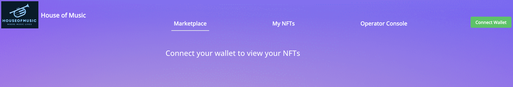
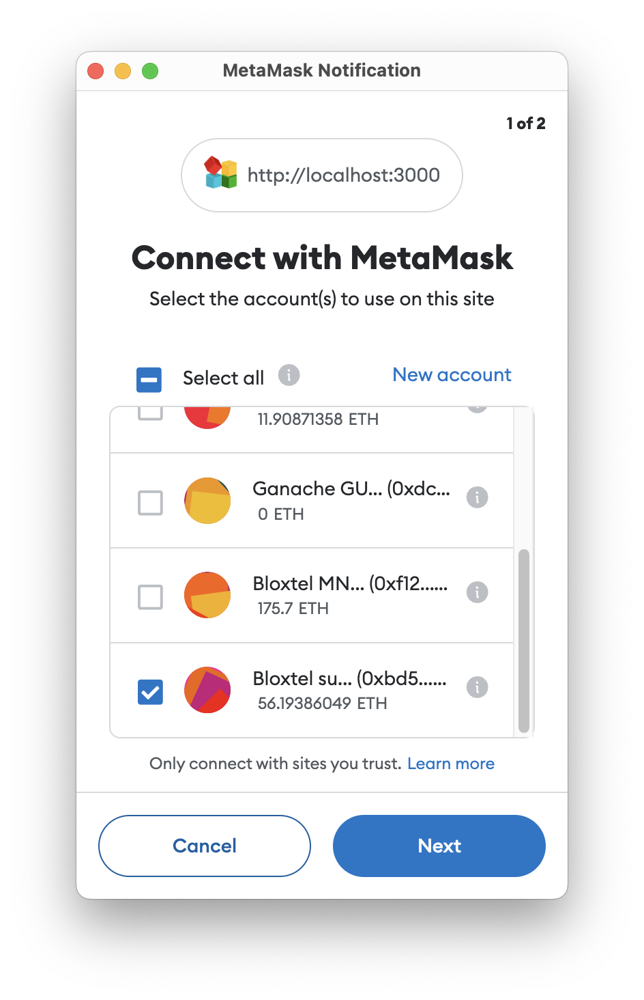
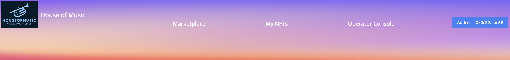
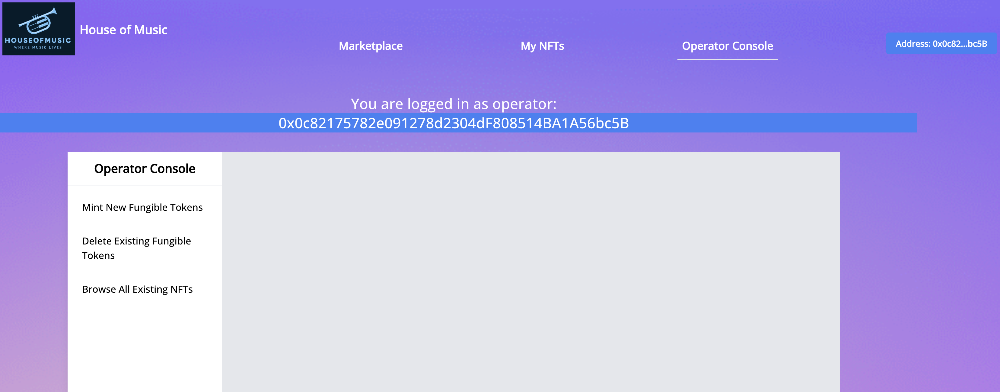
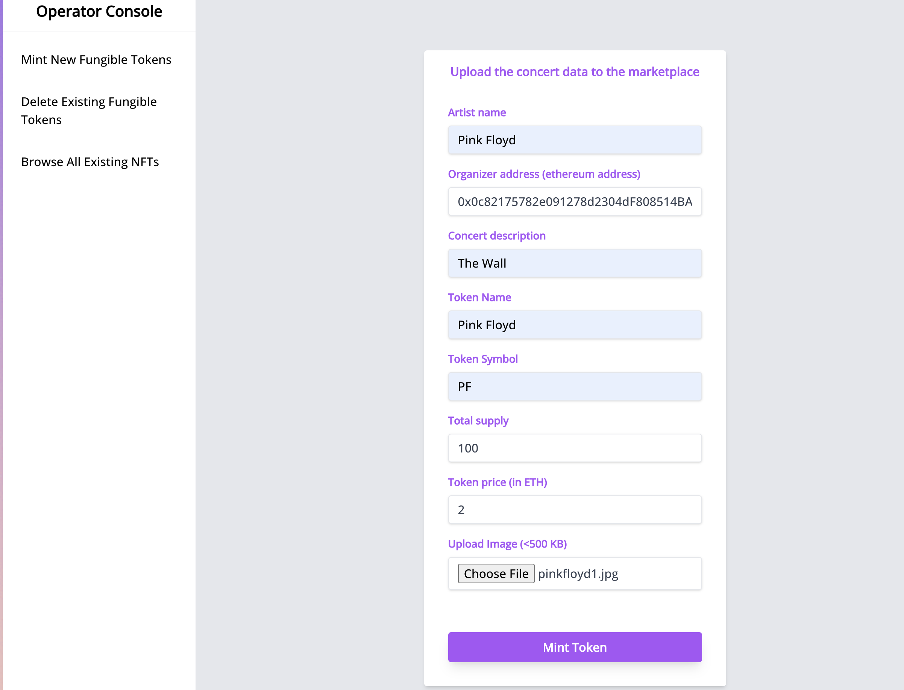
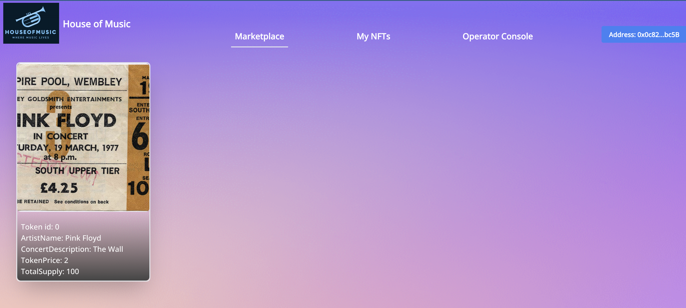
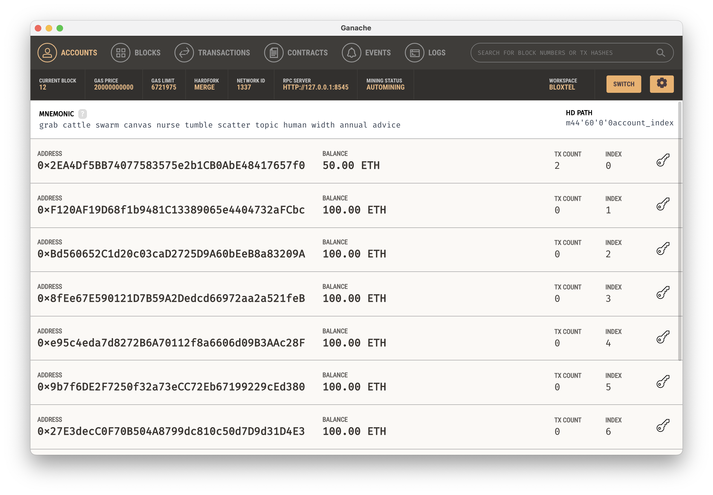
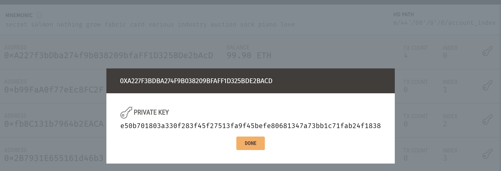
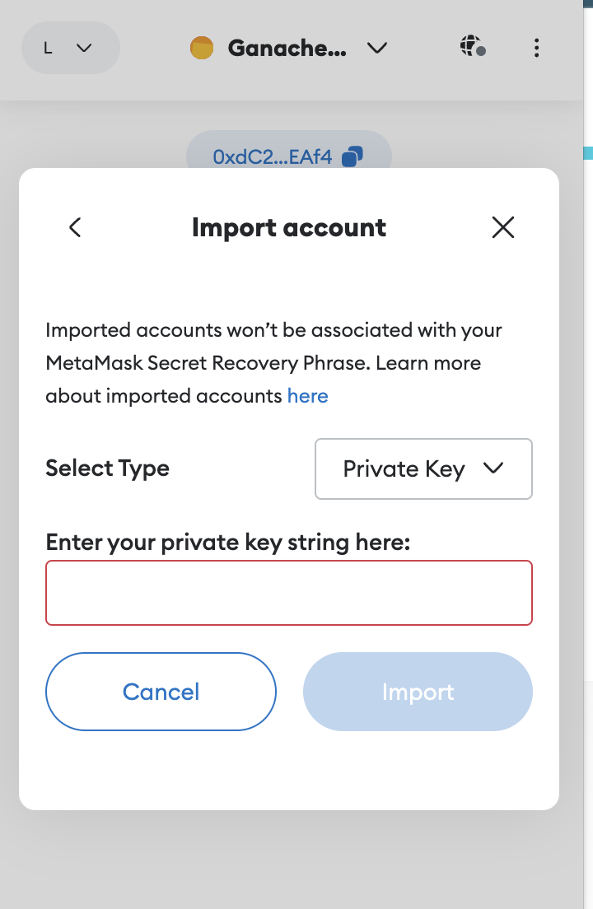

# House of Music: A Decentralized Concert Ticket Marketplace 🎵🎟️

**Tired of centralized systems taking control of your concert experiences?** Dive into the *House of Music*, a decentralized platform that empowers artists and fans alike. Built on the power of Ethereum and the efficiency of ERC-1155, this DApp changes the game in how concert tickets are minted, sold, and managed.

## 🌟 Features

- **Decentralized Marketplace:** Seamlessly sell and purchase concert tickets in a trustless environment.
- **Ticket Lifecycle Management:** From minting fungible tokens representing tickets for sale to burning them upon purchase to issue non-fungible tickets to buyers, it's all managed here.
- **Empower Artists and Organizers:** With the specialized 'operator' role, get the exclusivity to mint new ticket tokens.
- **Transparency Ensured:** Built on Ethereum, every ticket transaction is verifiable.
- **Hybrid Data Management:** Leveraging both a decentralized blockchain for ticket data and a centralized database for ticket metadata, giving you the best of both worlds.

## 🚀 Getting Started

### Prerequisites

- Node.js v16+
- npm v9+
- Docker v20+

### Installation & Deployment

1. **Clone the Magic:**  
   ```bash
   git clone https://github.com/alejoacosta74/erc1155-houseofmusic.git
   ```
   
2. **Set Up Your Environment:**  
   Rename the provided `.env.example` to `.env` and fill in the necessary details.

3. **Install Dependencies:**  
   ```bash
   npm install
   ```

4. **Awaken the Blockchain:**  
   Fire up a Ganache instance with:  
   ```bash
   make start-ganache
   ```

5. **Database at Ready:**  
   Boot a CouchDB instance:  
   ```bash
   make start-couchdb
   ```

6. **Unleash Smart Contracts:**  
   Deploy the smart contracts onto Ganache:  
   ```bash
   make deploy
   ```

7. **Elevate the DApp:**  
   Launch the Dapp with:  
   ```bash
   make start-dapp
   ```

8. **Experience the Decentralization:**  
   Navigate to [http://localhost:3000](http://localhost:3000) and make sure your Metamask is connected to your local Ganache instance.

    >    You can add the Ganache network in Metamask by clicking on the network dropdown and selecting 'Add Network', then select "Add Network Manually" and fill in the following fields:
    >  - Network Name: Ganache
    >  - New RPC URL: http://localhost:8545
    >  - Chain ID: 1337
    >  - Currency Symbol: ETH
    > 
    > Connect the Metamask account that corresponds to the 'operator' private key in the `.env` file

## Demo Guide 📖

Dive into the two main functionalities of House of Music DApp:

### PART I: Sale Opening for a New Concert
As an operator, mint ERC-1155 fungible tokens representing tickets.

* The first part of the demo consist in minting a new ERC 1155 fungible token that represents a batch of tickets for a concert.
* This is done by using the 'operator' role.
* The 'operator' role is the only one that can mint new fungible tokens, and is also the owner of the deployed smart contract to Ethereum. 

#### 1. Open the marketplace on your browser
   
   The marketplace is accesible at http://localhost:3000

    

#### 2. Connect the 'operator' account from your Metamask wallet.
   
   Open your Metamask wallet and switch to the 'subscriber' account.

    

   You should see the following screen:

    


#### 3. As the 'operator' account, put tickets for a new concert for sale (i.e. mint a ERC 1155 fungible token)

   3.1 Select 'Operator Console' from the Navigation bar. 

    


   3.2 Select 'Mint New Fungible Tokens' from the 'Operator Console' menu. 

    

   3.3 Fill in all the fields and click 'Mint'. 
   
   A Metamask window will pop up requesting your signature to approve the transaction

#### 4. View the available orders in the MarketPlace

   Once the transaction is approved, select the 'MarketPlace' tab on the upper menu:

    

### PART II: Purchasing a Ticket
As a consumer, experience the purchase of a concert ticket and see it transform into a unique ERC-1155 non-fungible token.

> The second part of the demo consists in purchasing a concert ticket (ERC 1155 non fungible token), using a 'consumer' role. 
> 
> Once the concert ticket is purchased, the new NFT purchased will be shown under the 'My NFTs' tab.
#### 1. Connect the 'consumer' account from your Metamask wallet
   Click on the 'Connect' button in the upper-right corner of the screen and select the 'consumer account from your Metamask wallet.

#### 2. Click on the minted concert order in the MarketPlace

    


#### 3. Click on the 'Purchase NFT' button
   > A Metamask window will pop up requesting your signature to approve the transaction.

   After transaction is approved, you should see the the current supply field decremented by 1:

    

#### 4. Verify your owned concert tickets
   Click on the 'My NFTs' tab on the upper menu. 

    

## ⚠️ Known Issues

The `ganache` instance running on docker is known to have issues with the Metamask wallet and the nonce of transactions. 
If you encounter any issues using the Dapp, please consider running the Ganache Desktop locally on your machine.
You can install the Ganache GUI from https://trufflesuite.com/docs/ganache/quickstart/
### Please bear in mind that if you choose to run Ganache locally, you would have to import the Ganache GUI private key into Metamask:
1. Open the Ganache GUI
2. Click the key icon under the ACCOUNTS tab, the pop-up screen will display the private key information for the preferred address selected as shown here:
   
   

3. Copy the private key
   
    

4. Then click on the Account button in the MetaMask upper-right corner.

5. Click Import Account
   
    

6. Paste the private key into the text box and click Import
   
Dont forget to update the `.env` file with:
- the private key taken from the Ganache GUI
- the port of the local Ganache instance (i.e. 7545)

## 🤝 Contribute

Love the *House of Music* and want to make it better? Fork this repository, make your changes, and raise a pull request! 

## 💖 Support

Encounter any issues or have a suggestion? Raise an issue in this repository.
